<h1 align="center">HR Attrition Analysis: What Drives Employees to Leave?</h1>

<p align="center">
  <b>SQL + Python Project | IBM HR Analytics Dataset</b><br>
  <sub>Analyzed 1,470 employee records using SQL queries and Python visualizations to identify key drivers of attrition.</sub>
</p>

<p align="center">
  
  
  
  
</p>

---
 
## Problem Statement
I built this project to figure out one thing — **why are employees leaving the company?**

Not just "who left", but what's common among people who left. Is it salary? Overtime? Their age? Their role? Or a mix of everything?

I used **SQL to ask the questions** and **Python to visualize the answers**.

---

## Key Questions I Wanted to Answer

Before I started writing any code, I had a few questions in mind:

- **Does overtime push people out?** Are employees who work extra hours more likely to quit?
- **Does money matter?** Are the ones leaving earning less than the ones staying?
- **Which roles and departments hurt the most?** Is this a company-wide thing or specific to certain teams?
- **What about age, experience, and satisfaction?** Do younger or newer employees leave more? Does being unhappy at work actually show up in the numbers?

The entire analysis is built around answering these questions with data, not guesses.

---

## Dataset

- **Source:** [IBM HR Analytics Employee Attrition & Performance](https://www.kaggle.com/datasets/pavansubhasht/ibm-hr-analytics-attrition-dataset) (Kaggle)
- **Size:** 1,470 employees, 35 columns
- **What it covers:** Age, salary, department, job role, satisfaction scores, overtime, years at company, attrition (yes/no), and more
- **Data quality:** No missing values, no duplicates, all values within valid ranges

> This is a fictional dataset created by IBM. The analysis is real, the data is not.

---

## Tools I Used

| Tool | What I Used It For |
|------|-------------------|
| **MySQL** | Wrote SQL queries to analyze attrition patterns |
| **Python (Pandas)** | Connected SQL results to Python for deeper analysis |
| **Matplotlib & Seaborn** | Created all the charts |
| **SciPy** | Ran a statistical t-test to validate findings |
| **Jupyter Notebook** | Everything runs in one notebook, start to finish |

---

## How I Approached This

I didn't just throw the data into charts. I followed a step-by-step process:

1. **Checked the data first** — looked for missing values, duplicates, and weird numbers
2. **Asked business questions using SQL** — attrition by department, role, salary, overtime, age, etc.
3. **Made charts for every finding** — so the patterns are easy to see
4. **Combined multiple factors** — to find which employee groups are at the highest risk
5. **Ran a statistical test** — to make sure the salary difference isn't just a coincidence
6. **Wrote findings and recommendations** — what should HR actually do about this

---

## What I Found

Here's the short version. The details are in the notebook.

**Overall:** 237 out of 1,470 employees left. That's a **16.12% attrition rate**.

---

### Overtime is the biggest problem

Employees who work overtime leave at **3x the rate** compared to those who don't (30.5% vs 10.4%).

This was the single strongest factor in the entire analysis.

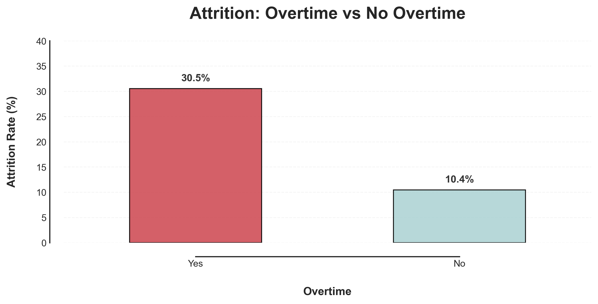

---

### People who left were earning less

Average income of employees who left: **~$4,787**
Average income of employees who stayed: **~$6,833**

I ran a t-test to check if this gap is real or just random — it's **statistically significant (p < 0.05)**.

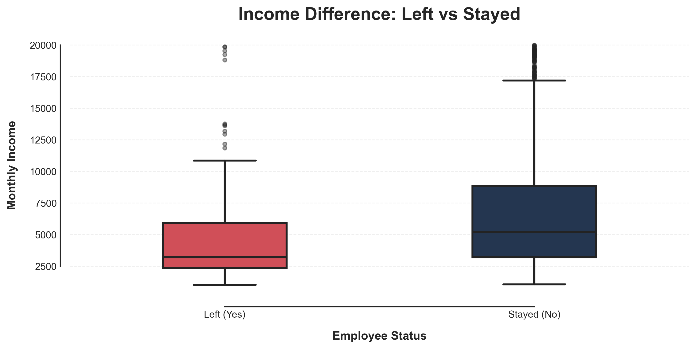

---

### Sales department is bleeding the most

Sales has the highest attrition at **20.6%**, followed by HR at **19.1%**. R&D is more stable at **13.8%**.

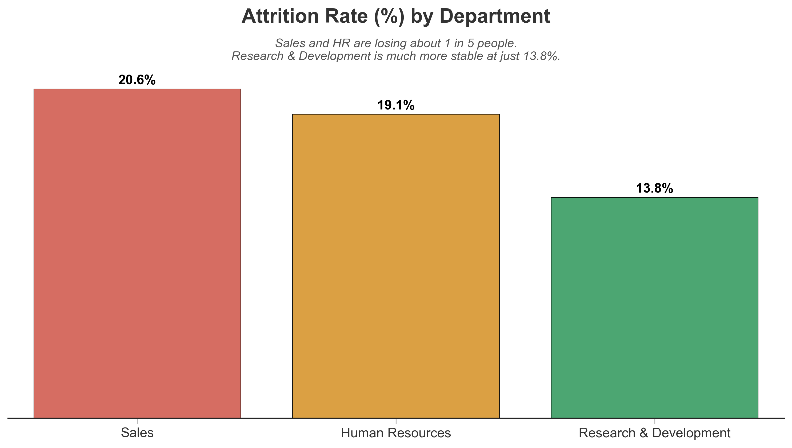

---

### Sales Representatives are the riskiest role

Sales Reps leave at **39.8%** — almost 10x more than Research Directors. That's a massive gap.

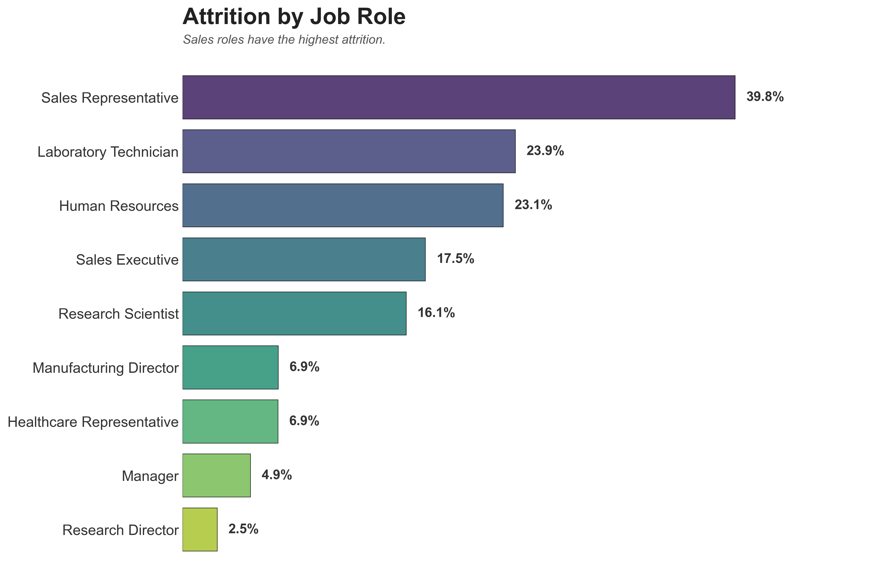

---

### Younger employees leave more

The 18–25 age group has **35.8% attrition** — the highest of any age bracket. It drops sharply after that.

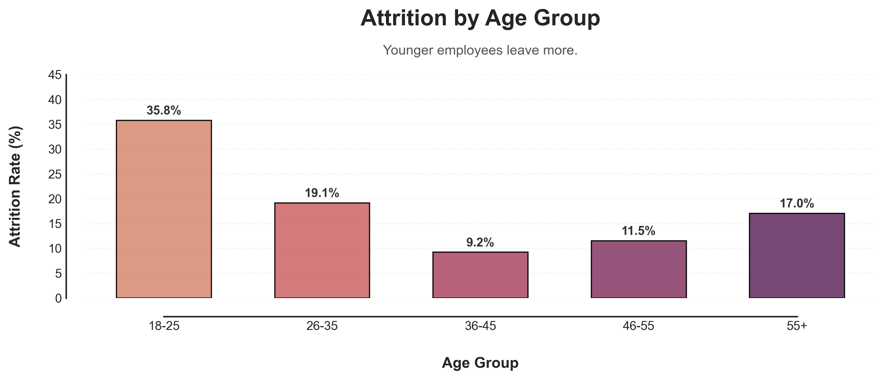

---

### Newer employees leave faster

Employees who left had an average tenure of **~5.1 years** vs **~7.4 years** for those who stayed. Most attrition happens in the early years.

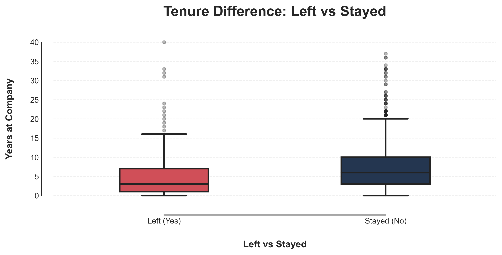

---

### Single employees leave more

Single employees have **25.5% attrition** — double the rate of married employees (12.5%).

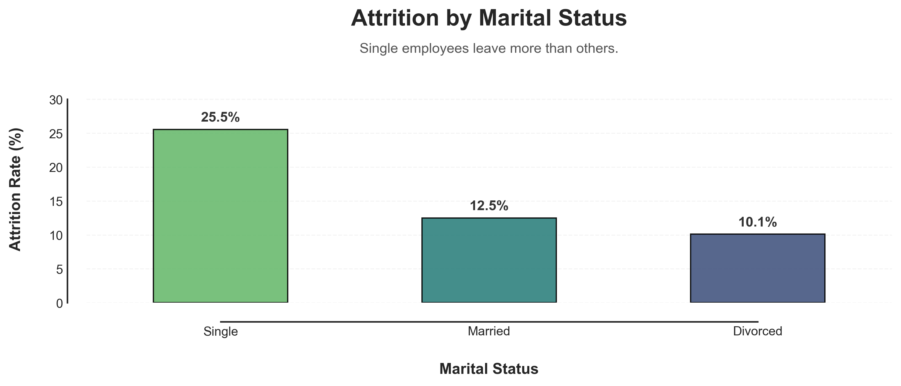

---

### Job satisfaction matters, but it's not the strongest factor

Satisfaction level 1 has **22.8% attrition** vs **11.3%** at level 4. It helps, but overtime and salary matter more.

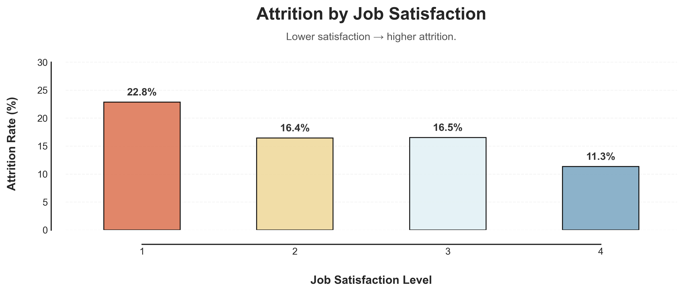

---

### Income gap exists across all departments

In every department, employees who left were earning less than those who stayed. This is a company-wide pattern, not a department-specific one.

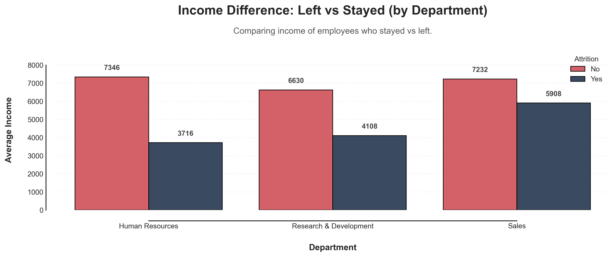

---

### Top 5 roles losing the most people (by count)

Lab Technicians and Sales Executives lose the most employees in absolute numbers, partly because these are larger teams.

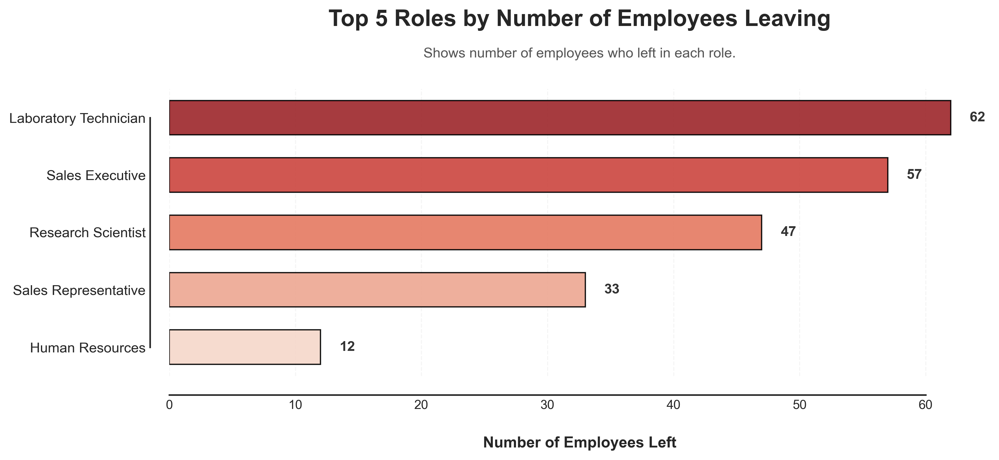

---

### When we combine multiple factors, the risk gets extreme

Sales Representatives working overtime have a **66.7% attrition rate**. Two out of three leave. Lab Technicians and HR employees with overtime also show a very high risk.

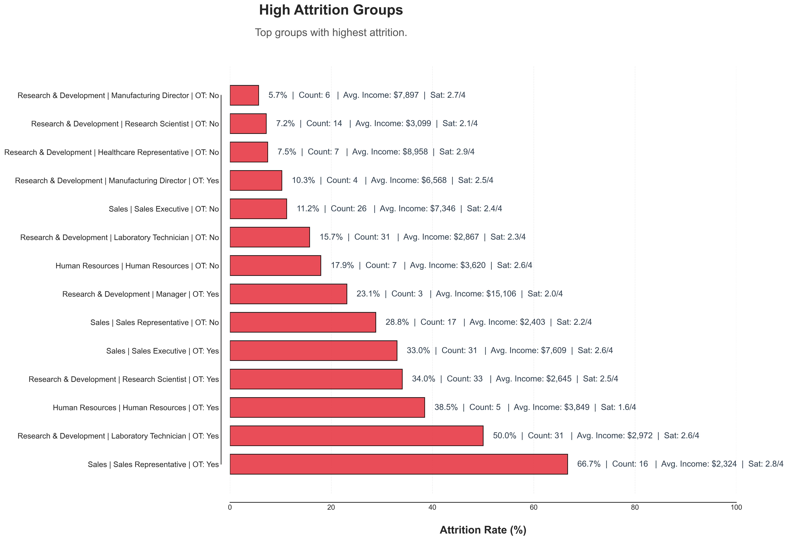

---

### Correlation heatmap — no single factor explains everything

Most features show weak correlation with attrition individually. This confirms that attrition is caused by a **combination of factors**, not just one thing.

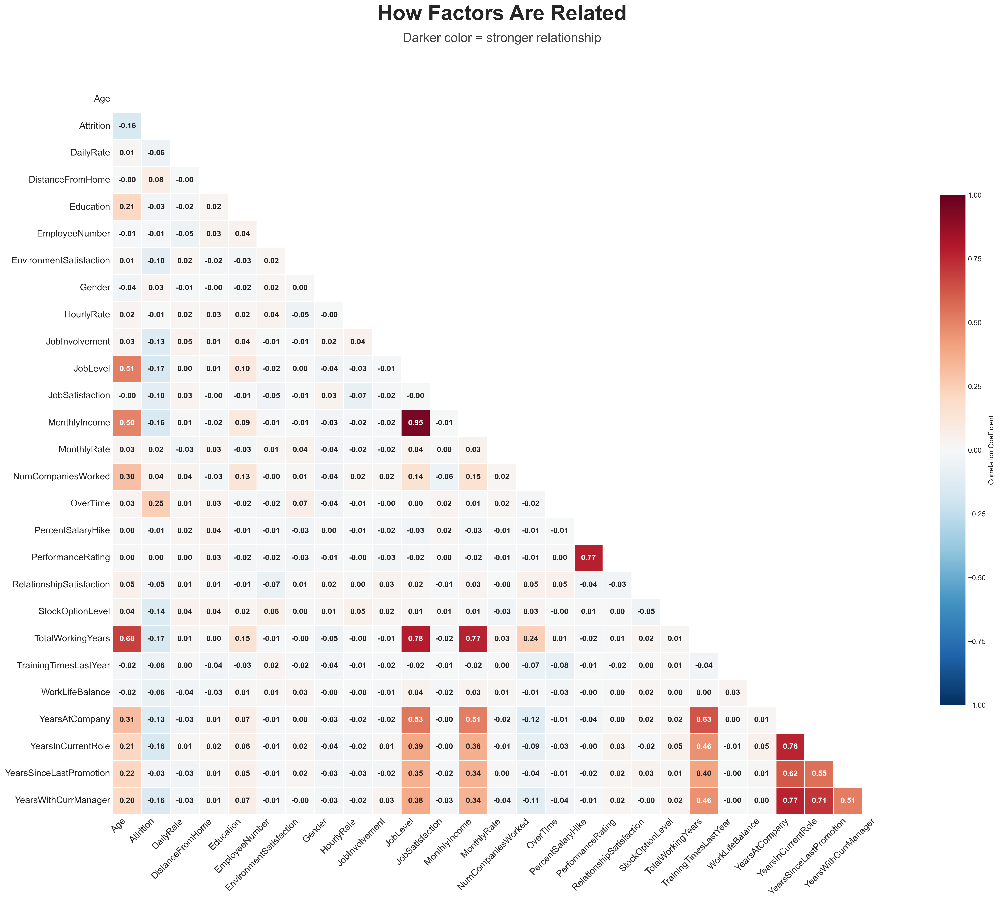

---

## Statistical Validation

I didn't want to just say "people who left earn less" and leave it at that. That could easily be a coincidence. So I ran a proper statistical test.

I used an **independent-samples t-test** to compare the income of employees who left vs those who stayed.

- **T-statistic: -6.20**
- **P-value: < 0.05**

What this means — the income difference between leavers and stayers is **real**. It's not random noise or luck in the data. Employees who left were genuinely earning less, and the numbers back that up.

---

### Advanced risk profiling with priority scores

I scored each employee group based on attrition rate, sample size, and statistical significance to find the groups that actually need attention — not just the ones with small samples and misleading numbers.

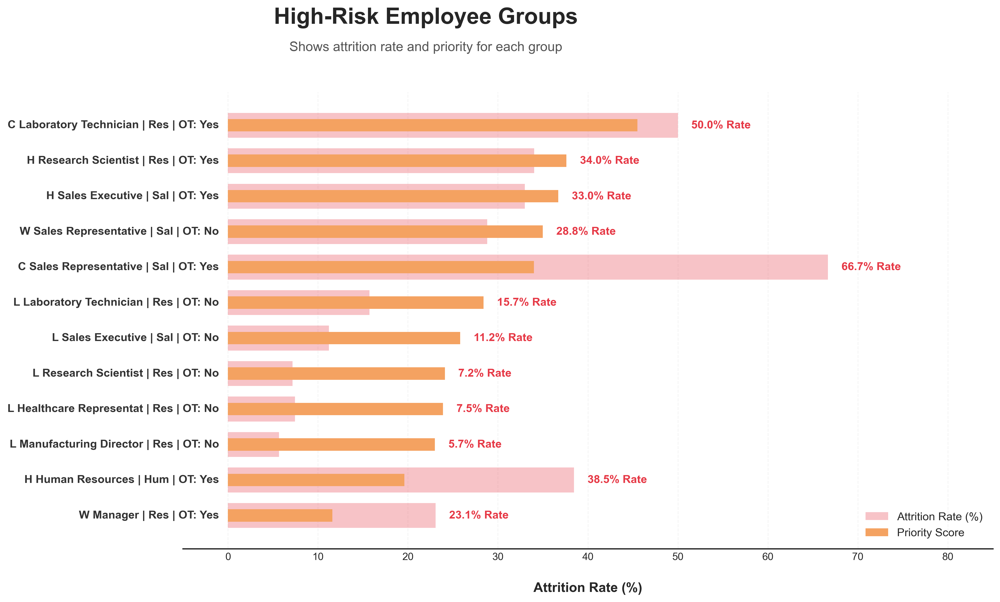

---

## Key Takeaway

Attrition doesn't happen because of one thing. No single column in the data explains it all.

It's a combination of:
- **Workload** — overtime pushes people out
- **Salary** — lower pay is linked with higher attrition across every department
- **Role** — some roles like Sales Rep and Lab Technician are hit much harder
- **Early tenure** — most people who leave do it in their first few years

But if I had to pick the one factor that matters most — **overtime is the strongest driver of attrition in this dataset.** Nothing else comes close to the 3x difference it creates.

---

## My Recommendations for HR

If I had to present this to an HR team, here's what I'd say:

1. **Fix the overtime problem first.** It's the strongest predictor. Audit overtime policies in Sales and R&D immediately.
2. **Review pay for Lab Technicians, Research Scientists, and Sales Reps.** These roles have high attrition and the leavers were earning below average.
3. **Focus on the first 5 years.** Most people leave early. Onboarding and early career growth programs would help.
4. **Pay attention to young employees (18–25).** They leave at more than double the company average. Mentorship or growth opportunities could help retain them.
5. **Don't rely on satisfaction scores alone.** They matter, but overtime and salary are bigger drivers. A satisfied employee who works overtime and earns less will still leave.

---

## What This Project Does NOT Do

I want to be honest about the limits:

- This is **not a prediction model**. I didn't build any ML. I identified patterns and risk factors.
- **Correlation is not causation.** For example, single employees leaving more might be because they're younger, not because they're single.
- The dataset is **fictional** (made by IBM), so these findings are for demonstration, not real business decisions.

---

## Project Structure

```
hr-attrition-analysis/
│
├── hr_attrition.ipynb          ← Full analysis notebook (SQL + Python + Charts)
├── data_setup.sql              ← The initial data setup in MySQL
├── README.md                   ← You're reading this
│
└── images/                     ← All chart images
    ├── Department_Attrition_Final.png
    ├── JobRole_Attrition_Final.png
    ├── Monthly_Income_Attrition.png
    ├── Overtime_Attrition.png
    ├── Tenure_Attrition.png
    ├── Age_Group_Attrition.png
    ├── Top_5_Attrition.png
    ├── Satisfaction_Attrition.png
    ├── Income_department_Attrition.png
    ├── Marital_Attrition.png
    ├── Comprehensive_Risk_Profile_Large.png
    ├── Correlation_Matrix_HighVis.png
    └── TopRiskPriorityBars_Premium.png
```

---

## How to Run This

1. Clone this repo
2. Make sure you have Python, MySQL, and Jupyter Notebook installed
3. Import the CSV into MySQL (table name: `hr_attrition`, database: `hr`)
4. Open `hr_attrition.ipynb` and update the MySQL connection credentials in the notebook
5. Run all cells

**Python libraries needed:**
```
pandas
matplotlib
seaborn
mysql-connector-python==8.0.33
scipy
numpy
```

---

## Author
 
**Ashish Kumar Dongre**
Data Analyst | Python, SQL, Pandas, Seaborn, Matplotlib
 
🔗 **LinkedIn:** [View My Profile](https://www.linkedin.com/in/analytics-ashish/)

📂 **Dataset:** [IBM HR Analytics Employee Attrition & Performance on Kaggle](https://www.kaggle.com/datasets/pavansubhasht/ibm-hr-analytics-attrition-dataset)

💻 **GitHub:** [analytics-ak](https://github.com/analytics-ak)

📘 **SQL/Python Files:** `data_setup.sql` · `hr_attrition.ipynb`


---
